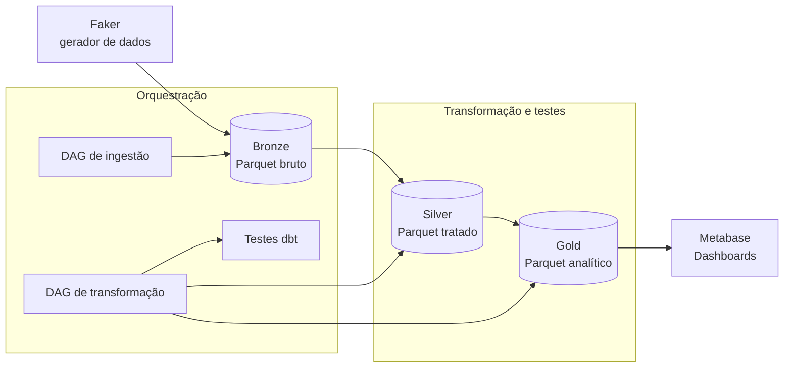

# Avaliação Experimental de Arquitetura Lakehouse para Suporte à Análise de Dados


Projeto de TCC do MBA em Data Science & Analytics (USP/Esalq) que avalia, de forma experimental e mensurável, os ganhos de uma arquitetura **Lakehouse** frente a um processo analítico **manual**. O experimento compara dois cenários submetidos à mesma base de dados e às mesmas perguntas de negócio, medindo cinco dimensões: **velocidade, integridade, governança, escalabilidade e eficiência operacional**.

---

## Sumário

- [Visão geral](#visão-geral)
- [Arquitetura](#arquitetura)
- [Stack tecnológica](#stack-tecnológica)
- [Estrutura do repositório](#estrutura-do-repositório)
- [Como executar](#como-executar)
- [Decisões técnicas](#decisões-técnicas)
- [Resultados](#resultados)
- [Trabalhos futuros](#trabalhos-futuros)

---

## Visão geral

Muitos processos analíticos nas organizações ainda são conduzidos manualmente, com extração e consolidação de dados em planilhas. Esse fluxo favorece retrabalho, inconsistências e baixa produtividade.

Este projeto implementa um pipeline Lakehouse completo e o compara a uma representação instrumentada do processo manual, quantificando os ganhos da arquitetura em um ambiente controlado e reprodutível.

O experimento define dois cenários:

- **Cenário A (manual):** script Python que lê os dados brutos e gera as análises sem tratamento de qualidade nem orquestração.
- **Cenário B (Lakehouse):** pipeline completo com camadas medalhão (bronze, silver, gold), testes automatizados, orquestração e camada de consumo em BI.

---

## Arquitetura

O pipeline segue a arquitetura medalhão, com dados persistidos em arquivos Parquet e processados pelo DuckDB.



**Camadas:**

- **Bronze:** dados brutos, exatamente como gerados, sem transformação.
- **Silver:** dados limpos e validados. Inconsistências são **sinalizadas** com flags booleanas, preservando o registro (camada de auditoria).
- **Gold:** dados prontos para consumo. Registros inconsistentes são **descartados** por decisão de negócio.

---

## Stack tecnológica

| Camada | Ferramenta |
|---|---|
| Geração de dados | Python + Faker |
| Armazenamento | Parquet (bronze / silver / gold) |
| Processamento | DuckDB |
| Transformação e testes | dbt (dbt-duckdb) |
| Orquestração | Apache Airflow (Docker) |
| Visualização (BI) | Metabase (Docker) |
| Versionamento | Git / GitHub |

---

## Estrutura do repositório

```
tcc-usp-lakehouse/
├── before/                  # Cenário A - script do processo manual
│   └── analise_manual.py
├── generator/               # Gerador de dados sintéticos
│   └── generator_data.py
├── data/                    # Arquivos Parquet
│   ├── bronze/
│   ├── silver/
│   └── gold/
├── dbt_project/lakehouse/   # Projeto dbt (modelos e testes)
│   └── models/
│       ├── silver/
│       └── gold/
├── dags/                    # DAGs do Airflow
│   ├── dag_ingestao.py
│   └── dag_transformacao.py
├── metabase/                # Configuração do Metabase (Docker)
│   ├── Dockerfile
│   └── docker-compose.yml
├── metrics/                 # Coleta de KPIs
│   └── coletar_kpis.py
└── README.md
```

---

## Como executar

### Pré-requisitos

- Python 3.13 (recomendado ambiente conda dedicado)
- Docker e Docker Compose
- dbt-duckdb

### 1. Clonar o repositório

```bash
git clone https://github.com/felipecaron21/tcc-usp-lakehouse.git
cd tcc-usp-lakehouse
```

### 2. Gerar os dados (camada bronze)

```bash
python generator/generator_data.py
```

### 3. Executar o Cenário A (processo manual)

```bash
python before/analise_manual.py
```

### 4. Executar o Cenário B (pipeline dbt)

```bash
cd dbt_project/lakehouse
dbt run --profiles-dir ~/.dbt
dbt test --profiles-dir ~/.dbt
```

### 5. Subir a orquestração (Airflow)

Suba a instância do Airflow via Docker e acione a `dag_transformacao`. A rotina executa silver, gold e os testes em sequência, com agendamento diário.

### 6. Subir o BI (Metabase)

```bash
cd metabase
docker compose up -d
```

Acesse `http://localhost:3000` e conecte ao banco DuckDB apontando para o catálogo `lakehouse.db`.

### 7. Coletar os KPIs

```bash
python metrics/coletar_kpis.py
```

Os resultados são salvos em CSV na pasta `metrics/`.

---

## Decisões técnicas

Esta seção documenta as principais decisões de arquitetura e o racional por trás de cada uma.

### 1. `materialized: external` para desacoplar storage e compute

Os modelos dbt são materializados como **arquivos Parquet externos**, e não como tabelas dentro do banco. Isso preserva o princípio de **desacoplamento entre armazenamento e processamento**, pilar central do Lakehouse. Os dados ficam em formato aberto, legíveis por qualquer engine (Pandas, Spark, Polars), evitando aprisionamento tecnológico (*vendor lock-in*). Sem essa decisão, o projeto seria um Data Warehouse tradicional com os dados presos no motor.

### 2. Silver sinaliza, gold descarta

Na camada **silver**, inconsistências são **sinalizadas** com flags booleanas em vez de excluídas, preservando a rastreabilidade e o volume original dos dados (caráter de auditoria). O **descarte** ocorre apenas na camada **gold**, como decisão consciente de negócio. Essa separação evita misturar diagnóstico de qualidade com regra de negócio na mesma etapa.

### 3. Dois catálogos DuckDB separados

O DuckDB não permite que dois processos abram o mesmo arquivo `.db` em modo de escrita simultaneamente. Para evitar conflito de *lock* entre o dbt e o Metabase, o projeto usa **dois catálogos separados**: `lakehouse.db` (consumido pelo Metabase em modo leitura) e `lakehouse_dbt.db` (usado pelo dbt). Como os dados reais vivem nos Parquet, ter dois catálogos de metadados não gera duplicação de dados.

### 4. `var('data_path')` para portabilidade entre ambientes

Os caminhos dos arquivos são parametrizados via variável `data_path`. Isso permite que os mesmos modelos rodem tanto **localmente** quanto **dentro do container Docker** (onde os caminhos diferem), passando a variável adequada em cada contexto, sem duplicar código.

### 5. Imagem Debian customizada do Metabase

A imagem padrão do Metabase é baseada em Alpine Linux, **incompatível com o driver DuckDB** por questões de *glibc*. A solução foi construir uma **imagem Debian customizada** via Dockerfile, garantindo a compatibilidade do driver e a conexão estável com o Lakehouse.

### 6. Instâncias Docker isoladas por projeto

Airflow e Metabase rodam em **instâncias Docker próprias e isoladas**, com seus respectivos `docker-compose.yml`. Isso segue a boa prática de manter cada projeto com ambiente independente, evitando conflitos de configuração, volumes e portas entre projetos distintos.

### 7. Script Python instrumentado como processo manual

O Cenário A foi implementado como um **script Python instrumentado**, não como planilha. A justificativa é metodológica: planilhas não permitem medição objetiva e reprodutível de tempo e etapas. O script replica o que um analista faria (ler dados brutos, cruzar tabelas, gerar análises) sem tratamento de qualidade, viabilizando uma comparação justa e mensurável. Trata-se de uma representação **conservadora**, pois mede apenas a execução, desconsiderando o tempo de desenvolvimento e interpretação inerente ao processo manual real.

### 8. Full load como decisão consciente

O pipeline adota **carga completa (full load)** em vez de carga incremental. Para o escopo e o volume do experimento, o full load simplifica a implementação e garante reprodutibilidade. A carga incremental é reconhecida como evolução natural e está registrada como trabalho futuro.

> **Nota sobre armazenamento:** em ambiente produtivo, os dados residiriam em *object storage* externo (ex: S3, GCS), desacoplados do repositório de código. O uso de disco local com versionamento em Git foi adotado como simplificação metodológica, priorizando a reprodutibilidade acadêmica.

---

## Resultados

Síntese comparativa entre os cenários nos cinco indicadores avaliados:

| Indicador | Cenário A (manual) | Cenário B (Lakehouse) |
|---|---|---|
| **Integridade** | 0 inconsistências detectadas | 1.662 detectadas e tratadas (95,51% válidos) |
| **Governança** | 0 testes | 51 testes automatizados + lineage + documentação |
| **Eficiência operacional** | 4 etapas manuais por execução | 0 (orquestração agendada) |
| **Escalabilidade** | tempo estável, sem validação | melhora proporcional ao volume |
| **Velocidade** | 0,39 s (execução isolada) | 6,29 s (pipeline completo com validação) |

> A dimensão de velocidade requer interpretação contextualizada: o menor tempo do Cenário A não considera desenvolvimento, validação e retrabalho, que se repetem a cada nova análise. O tempo de execução não equivale ao tempo total de entrega.

**Detalhamento das inconsistências detectadas (camada silver):**

| Tabela | Inconsistências | % |
|---|---|---|
| customers | 369 | 4,61% |
| orders | 331 | 3,31% |
| products | 166 | 5,53% |
| sellers | 30 | 3,00% |
| order_items | 766 | 5,11% |

---

## Autor

**Felipe Caron de Almeida Prado**
MBA em Data Science & Analytics — USP/Esalq
