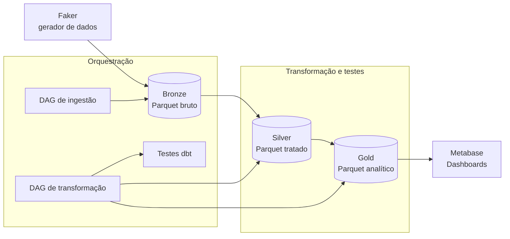

# Avaliação experimental de princípios da arquitetura Lakehouse frente a processos analíticos ad-hoc


Projeto de TCC do MBA em Data Science & Analytics (USP/Esalq) que avalia, de forma experimental e mensurável, os princípios da arquitetura **Lakehouse** frente a um processo analítico **ad-hoc**. O experimento compara dois cenários submetidos à mesma base de dados e às mesmas perguntas de negócio, medindo cinco dimensões: **velocidade, integridade, governança, escalabilidade e eficiência operacional**.

---

## Sumário

- [Visão geral](#visão-geral)
- [Arquitetura](#arquitetura)
- [Stack tecnológica](#stack-tecnológica)
- [Base de dados sintética](#base-de-dados-sintética)
- [Estrutura do repositório](#estrutura-do-repositório)
- [Como executar](#como-executar)
- [Decisões técnicas](#decisões-técnicas)
- [Resultados](#resultados)

---

## Visão geral

Muitos processos analíticos nas organizações ainda são conduzidos de forma ad-hoc, por meio de scripts avulsos, queries SQL isoladas ou planilhas, sem camadas de transformação, testes de qualidade ou orquestração. Esse fluxo favorece retrabalho, inconsistências e baixa rastreabilidade.

Este projeto implementa um pipeline baseado nos princípios Lakehouse e o compara a uma representação instrumentada do processo ad-hoc, quantificando as diferenças entre as abordagens em um ambiente controlado e reprodutível.

O experimento define dois cenários:

- **Cenário A (ad-hoc):** script Python avulso que lê os dados brutos e gera as análises sem tratamento de qualidade nem orquestração.
- **Cenário B (Lakehouse):** pipeline com camadas medalhão (bronze, silver, gold), testes automatizados, orquestração e camada de consumo em BI.

Ambos respondem às mesmas quatro perguntas de negócio: total de pedidos por status, ticket médio por categoria de produto, ranking dos cinco principais vendedores e tempo médio de entrega por estado.

---

## Arquitetura

O pipeline segue a arquitetura medalhão, com dados persistidos em arquivos Parquet e processados pelo DuckDB.


```mermaid
flowchart LR
    A[Faker\ngerador de dados] --> B[(Bronze\nParquet bruto)]
    B --> C[(Silver\nParquet tratado)]
    C --> D[(Gold\nParquet analítico)]
    D --> E[Metabase\nDashboards]

    subgraph dbt [Transformação e testes]
        C
        D
    end

    subgraph Airflow [Orquestração]
        ING[DAG de ingestão] --> B
        TRANS[DAG de transformação] --> C
        TRANS --> D
        TRANS --> TEST[Testes dbt]
    end
```

**Camadas:**

- **Bronze:** dados brutos, exatamente como gerados, sem transformação.
- **Silver:** dados limpos e validados. Inconsistências são **sinalizadas** com flags booleanas, preservando o registro (camada de auditoria).
- **Gold:** dados prontos para consumo. Registros inconsistentes são **descartados** por decisão de negócio.

---

## Stack tecnológica

| Camada | Ferramenta |
|---|---|
| Geração de dados | Python + Faker |
| Armazenamento | Parquet (bronze / silver / gold) |
| Processamento | DuckDB |
| Transformação e testes | dbt (dbt-duckdb) |
| Orquestração | Apache Airflow (Docker) |
| Visualização (BI) | Metabase (Docker) |
| Versionamento | Git / GitHub |

---

## Base de dados sintética

A base segue o esquema relacional do conjunto público Brazilian E-Commerce (Olist), com cinco tabelas: clientes, pedidos, itens de pedido, produtos e vendedores. Os registros são gerados com a biblioteca Faker e semente fixa (`seed=42`), o que garante resultados idênticos a cada execução.

No volume base de 10.000 pedidos, são gerados 8.000 clientes (mais 240 duplicatas, totalizando 8.240 na bronze), 3.000 produtos, 1.000 vendedores e 15.000 itens de pedido.

Durante a geração, inconsistências são inseridas de forma probabilística, segundo uma proporção-alvo por tipo de defeito. Por isso, as quantidades observadas variam em torno dos percentuais nominais. O próprio script de geração emite um relatório com a contagem exata de cada defeito:

| Tabela | Tipo de inconsistência | Mecanismo | Proporção-alvo | Quantidade |
|---|---|---|---|---|
| customers | Valores nulos em cidade e estado | Substituição | 5% | 369 |
| customers | Registros duplicados | Acréscimo | 3% | 240 |
| products | Categoria nula | Substituição | 6% | 166 |
| sellers | UF fora do domínio válido | Substituição | 3% | 30 |
| orders | Status inválido | Substituição | 2% | 237 |
| orders | Pedidos entregues sem data de entrega | Substituição | 4% dos entregues | 94 |
| order_items | Preço menor ou igual a zero | Substituição | 2% | 341 |
| order_items | `order_id` órfão | Substituição | 3% | 425 |
| **Total** | | | | **1.902** |

Das 1.902 inconsistências, as 240 duplicatas são removidas por deduplicação na camada silver, e as 1.662 restantes são sinalizadas por flags de validação.

---

## Estrutura do repositório

```
tcc-usp-lakehouse/
├── before/                  # Cenário A - script do processo ad-hoc
│   └── analise_manual.py
├── generator/               # Gerador de dados sintéticos (com relatório de defeitos)
│   └── generator_data.py
├── data/                    # Arquivos Parquet (não versionados; pastas mantidas com .gitkeep)
│   ├── bronze/
│   ├── silver/
│   └── gold/
├── dbt_project/lakehouse/   # Projeto dbt (modelos, testes e profile do container)
│   ├── profiles.yml
│   └── models/
│       ├── silver/          # 5 modelos + schema.yml (37 testes)
│       └── gold/            # 4 modelos + schema.yml (14 testes)
├── dags/                    # DAGs do Airflow
│   ├── dag_ingestao.py
│   └── dag_transformacao.py
├── metabase/                # Configuração do Metabase (Docker)
│   ├── dockerfile
│   └── docker-compose.yml
├── metrics/                 # Coleta de KPIs, CSVs de resultados e logs das rodagens
│   ├── coletar_kpis.py
│   ├── tempos_bruto.csv / tempos_resumo.csv
│   ├── escalabilidade_bruto.csv / escalabilidade_resumo.csv
│   ├── integridade.csv
│   ├── kpis_consolidado.csv
│   └── log_coleta_5m.txt    # Log da coleta final (até 5M pedidos)
├── docker-compose.yaml      # Ambiente do Airflow
├── .env.example             # Referência de variáveis de ambiente
├── LICENSE
└── README.md
```

---

## Como executar

### Pré-requisitos

- Docker e Docker Compose
- Python 3.13 com `faker`, `pandas`, `pyarrow` e `dbt-duckdb` (opcional, necessário apenas para rodar o gerador, o Cenário A e a coleta de KPIs fora do container)

### 1. Clonar o repositório e configurar o ambiente

```bash
git clone https://github.com/felipecaron21/tcc-usp-lakehouse.git
cd tcc-usp-lakehouse

cp .env.example .env
```

Gere a chave de criptografia do Airflow e preencha o campo `FERNET_KEY` no `.env`:

```bash
python -c "from cryptography.fernet import Fernet; print(Fernet.generate_key().decode())"
```

O arquivo `.env` não é versionado. Use o `.env.example` como referência das variáveis esperadas.

### 2. Gerar os dados (camada bronze)

```bash
python generator/generator_data.py
```

Ao final, o script imprime a quantidade de registros por tabela e o relatório de defeitos inseridos. Os arquivos Parquet não são versionados, então este passo (ou a `dag_ingestao`) é obrigatório após clonar.

### 3. Executar o Cenário A (processo ad-hoc)

```bash
python before/analise_manual.py
```

### 4. Subir a orquestração (Airflow)

```bash
docker compose up -d
```

Acesse `http://localhost:8080` e faça login com as credenciais definidas no `.env` (por padrão, `airflow` / `airflow`).

- `dag_ingestao`: gera os dados na camada bronze (execução manual).
- `dag_transformacao`: executa silver, gold e os testes dbt em sequência, com agendamento diário.

O repositório é montado em `/opt/tcc` dentro dos containers, e é esse caminho que os DAGs usam para localizar o projeto dbt e os dados. O dbt do container usa o `profiles.yml` do próprio projeto, que grava o catálogo em `/opt/tcc/lakehouse_dbt.db`.

Para encerrar o ambiente preservando o histórico de execuções:

```bash
docker compose down
```

### 5. Executar o dbt localmente (alternativa ao Airflow)

Este passo é opcional e destina-se a quem prefere rodar as transformações sem Docker. Requer `dbt-duckdb` instalado e um profile configurado em `~/.dbt`.

```bash
cd dbt_project/lakehouse
dbt run --profiles-dir ~/.dbt --vars '{"data_path": "<caminho-absoluto>/tcc-usp-lakehouse/data"}'
dbt test --profiles-dir ~/.dbt --vars '{"data_path": "<caminho-absoluto>/tcc-usp-lakehouse/data"}'
```

### 6. Subir o BI (Metabase)

O driver DuckDB do Metabase não é versionado. Antes do build, baixe o arquivo `duckdb.metabase-driver.jar` na página de releases do [metabase_duckdb_driver](https://github.com/motherduckdb/metabase_duckdb_driver/releases) e salve-o em `metabase/plugins/`.

```bash
cd metabase
docker compose up -d
```

Acesse `http://localhost:3000`, adicione um banco do tipo DuckDB e informe o caminho `/opt/tcc/lakehouse_dbt.db` (catálogo gerado pelo pipeline do Airflow). Execute a `dag_transformacao` antes de conectar, para que as tabelas existam no catálogo.

### 7. Coletar os KPIs

Antes de executar, ajuste a variável `BASE_PATH` no início de `metrics/coletar_kpis.py` para o caminho do repositório na sua máquina.

```bash
python metrics/coletar_kpis.py
```

O script executa 10 rodagens de cada cenário no volume padrão (10.000 pedidos) e 10 rodagens por volume no teste de escalabilidade (10 mil a 5 milhões de pedidos), calculando média, desvio padrão, mínimo, máximo e mediana. A execução completa pode levar bastante tempo por causa dos volumes maiores. Os resultados são salvos em CSV na pasta `metrics/`, e a base é restaurada ao volume padrão ao final.

---

## Decisões técnicas

Esta seção documenta as principais decisões de arquitetura e o racional por trás de cada uma.

### 1. `materialized: external` para desacoplar storage e compute

Os modelos dbt são materializados como **arquivos Parquet externos**, e não como tabelas dentro do banco. Isso preserva o princípio de **desacoplamento entre armazenamento e processamento**, pilar central do Lakehouse. Os dados ficam em formato aberto, legíveis por qualquer engine (Pandas, Spark, Polars), evitando aprisionamento tecnológico (*vendor lock-in*). Os arquivos `.db` do DuckDB atuam apenas como **catálogos de metadados**; os dados efetivos residem nos Parquet.

### 2. Lakehouse como conjunto de princípios

O termo Lakehouse é adotado em referência aos seus princípios: desacoplamento entre armazenamento e processamento, formato aberto e colunar (Parquet) e organização em camadas medalhão. A camada transacional oferecida por formatos como **Delta Lake** e **Apache Iceberg** (ACID, *time travel*) não foi implementada, por não ser necessária ao objetivo do experimento.

### 3. Silver sinaliza, gold descarta

Na camada **silver**, inconsistências são **sinalizadas** com flags booleanas em vez de excluídas, preservando a rastreabilidade e o volume original dos dados (caráter de auditoria). A exceção são as duplicatas, removidas por deduplicação. O **descarte** dos registros sinalizados ocorre apenas na camada **gold**, como decisão consciente de negócio. Essa separação evita misturar diagnóstico de qualidade com regra de negócio na mesma etapa.

### 4. Catálogos DuckDB separados por ambiente de execução

O DuckDB não permite que dois processos abram o mesmo arquivo `.db` em modo de escrita simultaneamente. Por isso, a execução local do dbt (profile em `~/.dbt`, usada pela coleta de KPIs) e a execução orquestrada pelo Airflow (catálogo `lakehouse_dbt.db`, consumido pelo Metabase) usam catálogos separados. Como os dados reais vivem nos Parquet, ter mais de um catálogo de metadados não gera duplicação de dados.

### 5. `var('data_path')` para portabilidade entre ambientes

Os caminhos dos arquivos são parametrizados via variável `data_path`. Isso permite que os mesmos modelos rodem tanto **localmente** quanto **dentro do container Docker** (onde os caminhos diferem), passando a variável adequada em cada contexto, sem duplicar código.

### 6. Imagem customizada do Metabase

A imagem padrão do Metabase é baseada em Alpine Linux, **incompatível com o driver DuckDB** por questões de *glibc*. A solução foi construir uma **imagem customizada** a partir de `eclipse-temurin:21-jre` (baseada em glibc), que executa o `metabase.jar` com o driver DuckDB carregado como plugin.

### 7. Ambiente versionado e reprodutível, com instâncias isoladas por serviço

Airflow e Metabase rodam em **instâncias Docker próprias e isoladas**, com seus respectivos arquivos de composição. Isso evita conflitos de configuração, volumes e portas entre serviços com ciclos de vida distintos.

Ambos os arquivos são **versionados no repositório e usam caminhos relativos**, de modo que o ambiente seja reproduzível em qualquer máquina: basta clonar o repositório e subir os containers. Credenciais e configurações sensíveis ficam fora do versionamento, em `.env`, com `.env.example` servindo de referência das variáveis esperadas. Os arquivos Parquet e os catálogos `.db` também não são versionados, pois são regenerados pelo próprio pipeline.

O repositório é montado em `/opt/tcc` nos containers do Airflow e do Metabase, permitindo que os DAGs e o BI acessem o projeto dbt, os dados e o catálogo por um caminho estável, independente de onde o repositório esteja clonado na máquina hospedeira.

### 8. Script Python instrumentado como processo ad-hoc

O Cenário A foi implementado como um **script Python instrumentado**, não como planilha. A justificativa é metodológica: planilhas não permitem medição objetiva e reprodutível de tempo e etapas. O script replica o que um analista faria (ler dados brutos, cruzar tabelas, gerar análises) sem tratamento de qualidade, viabilizando uma comparação justa e mensurável. Trata-se de uma representação **conservadora**, pois mede apenas a execução, desconsiderando o tempo de desenvolvimento, interpretação e retrabalho inerentes ao processo ad-hoc.

### 9. Múltiplas rodagens para robustez estatística

Cada medição de tempo é repetida **10 vezes**, registrando média, desvio padrão, mínimo, máximo e mediana. Isso reduz o efeito de variações pontuais de desempenho da máquina. Os indicadores determinísticos (inconsistências detectadas, quantidade de testes) são coletados uma única vez, já que a semente fixa garante resultados idênticos.

### 10. Full load como decisão consciente

O pipeline adota **carga completa (full load)** em vez de carga incremental. Para o escopo e o volume do experimento, o full load simplifica a implementação e garante reprodutibilidade. A carga incremental é reconhecida como evolução natural e está registrada como trabalho futuro.

> **Nota sobre armazenamento:** em ambiente produtivo, os dados residiriam em *object storage* externo (ex: S3, GCS), desacoplados do repositório de código. O uso de disco local foi adotado como simplificação metodológica, priorizando a reprodutibilidade acadêmica.

---

## Resultados

Síntese comparativa entre os cenários nos cinco indicadores avaliados (base de 10.000 pedidos):

| Indicador | Cenário A (ad-hoc) | Cenário B (Lakehouse) |
|---|---|---|
| **Velocidade** | 0,30 s (média de 10 rodagens; dp 0,02 s) | 5,44 s (média de 10 rodagens; dp 0,43 s) |
| **Integridade** | 0 inconsistências detectadas | 1.662 detectadas e tratadas (95,51% válidos) |
| **Governança** | 0 testes | 51 testes automatizados (37 silver, 14 gold) em 9 modelos + linhagem + documentação |
| **Escalabilidade** | 0,30 s → 12,41 s (10 mil → 5 milhões; ~42x) | 5,29 s → 28,51 s (10 mil → 5 milhões; ~5,4x) |
| **Eficiência operacional** | 4 etapas ad-hoc por execução | 0 (orquestração agendada) |

> A dimensão de velocidade requer interpretação contextualizada: o tempo do Cenário B inclui a transformação completa (silver e gold) e os 51 testes, enquanto o do Cenário A não considera desenvolvimento, validação e retrabalho, que se repetem a cada nova análise. O tempo de execução não equivale ao tempo total de entrega.

**Escalabilidade (tempo médio de 10 rodagens, em segundos):**

| Pedidos | Cenário A | Cenário B | Razão B/A |
|---|---|---|---|
| 10.000 | 0,296 | 5,289 | 17,9 |
| 50.000 | 0,342 | 5,490 | 16,1 |
| 100.000 | 0,407 | 5,790 | 14,2 |
| 500.000 | 1,031 | 8,032 | 7,8 |
| 1.000.000 | 1,885 | 10,258 | 5,4 |
| 5.000.000 | 12,413 | 28,513 | 2,3 |

O Cenário B tem um custo fixo maior (inicialização do dbt e execução dos testes), que se dilui com o aumento do volume: a diferença relativa entre os cenários cai de cerca de 18 vezes em 10 mil pedidos para cerca de 2 vezes em 5 milhões.

**Inconsistências detectadas na camada silver:**

| Tabela | Registros | Inconsistências | % |
|---|---|---|---|
| customers | 8.000 | 369 | 4,61% |
| orders | 10.000 | 331 | 3,31% |
| products | 3.000 | 166 | 5,53% |
| sellers | 1.000 | 30 | 3,00% |
| order_items | 15.000 | 766 | 5,11% |
| **Total** | **37.000** | **1.662** | **4,49%** |

---

## Autor

**Felipe Caron de Almeida Prado**
MBA em Data Science & Analytics — USP/Esalq